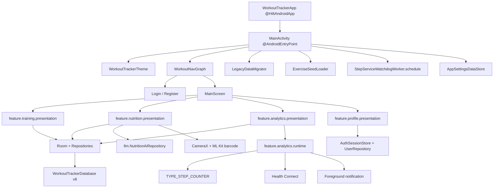
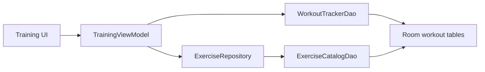
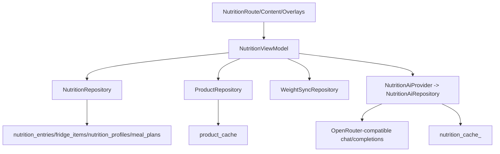
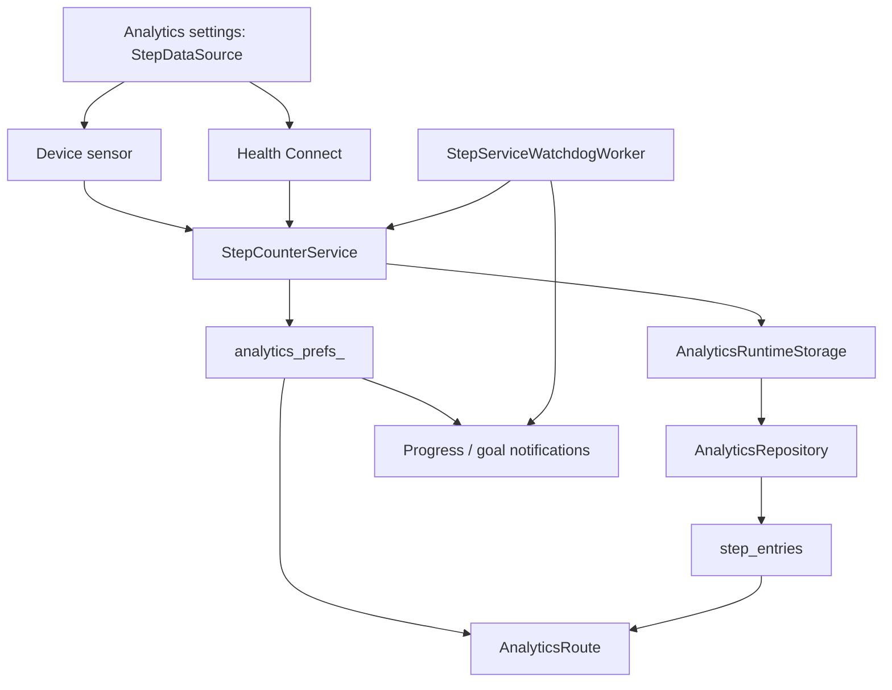
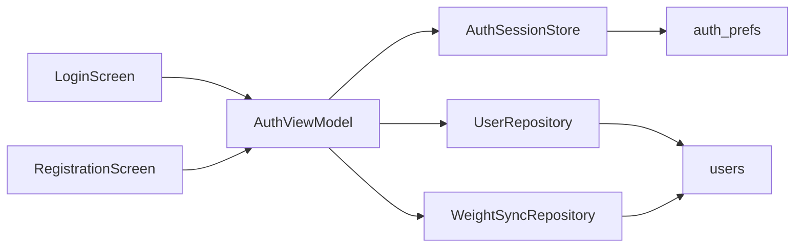
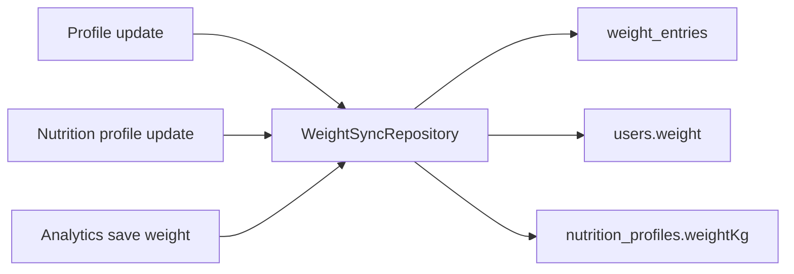
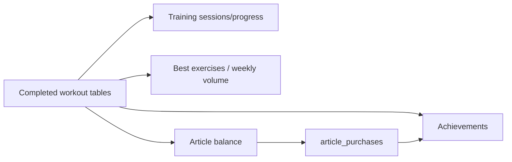
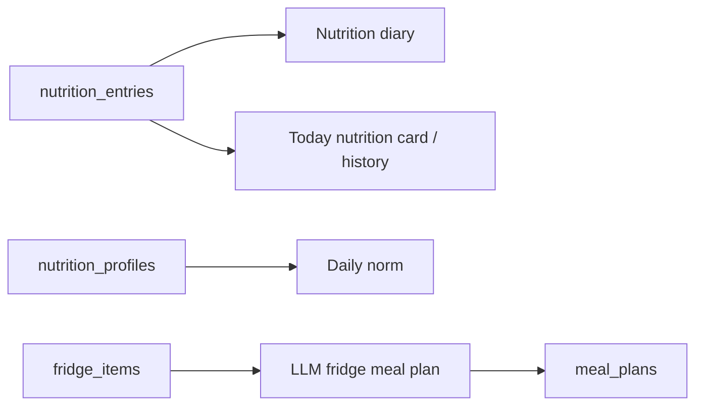

# Архитектурная карта WorkoutTracker

Актуализировано: 2026-04-26

Карта описывает фактическое состояние рабочей копии проекта на диске. Проект находится в активной миграции: feature-first пакеты уже переехали физически, но часть слоев все еще содержит переходные связи, крупные presentation-файлы и legacy-хвосты.

## 1. Краткий Срез

| Область | Текущее состояние |
| --- | --- |
| Платформа | Android, Kotlin, Jetpack Compose, Material 3 |
| Модульность | Один Gradle-модуль `:app` |
| Архитектурная ось | `UI/Route -> ViewModel -> Repository/DAO -> Room/DataStore/SharedPreferences` |
| DI | Hilt через `WorkoutTrackerApp`, `@AndroidEntryPoint` в `MainActivity`, модули в `core/di` |
| Навигация | `login`, `register`, `main`; внутри `main` сейчас 4 вкладки |
| Основное хранилище | Room DB `workout_tracker.db`, версия 8 |
| Настройки | `AppSettingsDataStore` |
| Auth/session и runtime flags | `SharedPreferences` через `AuthSessionStore` и analytics runtime prefs |
| Фичи в активной навигации | `Training`, `Nutrition`, `Analytics`, `Profile` |
| Фичи в коде, но не в Main nav | `Articles`, `Achievements` |
| Внешние интеграции | Health Connect, Android step sensor, OpenWeather, OpenRouter-compatible LLM API, CameraX + ML Kit barcode |
| Основной долг | Крупные presentation-файлы, прямые cross-layer зависимости, hardcoded keys, mojibake-строки, отключенные фичи Articles/Achievements |

Ключевой вывод: проект уже не является старым `ui/* + viewmodel/*` монолитом. Основная масса продуктовых фич живет в `feature/<name>/presentation`, но настоящий feature-first еще не завершен, потому что data/domain слои в основном общие, а некоторые data-классы импортируют presentation-модели.

## 2. Карта Деревьев

Фактический срез `app/src/main/java/com/example/workouttracker`:

| Пакет | Файлов | Назначение |
| --- | ---: | --- |
| `core` | 5 | Auth/session store, DI, базовый presentation contract |
| `data` | 16 | Room entities/DAO/database, repositories, DataStore, exercise catalog |
| `feature` | 73 | Основные пользовательские фичи, сейчас почти полностью presentation-first |
| `health` | 2 | Health Connect gateway и rationale activity |
| `llm` | 3 | Провайдер и repository генерации nutrition meal plan через LLM |
| `ui` | 12 | Auth screens, navigation shell, theme, shared UI helpers |
| `viewmodel` | 2 | Legacy/auth ViewModel и старые training defaults |
| `workers` | 1 | WorkManager watchdog для step runtime |
| root files | 2 | `WorkoutTrackerApp`, `MainActivity` |

Физическая структура:

```text
app/src/main/java/com/example/workouttracker/
  core/
    auth/
    di/
    presentation/
  data/
    exercise/
    local/
    settings/
  feature/
    achievements/presentation/
    analytics/presentation/
    analytics/runtime/
    articles/presentation/
    nutrition/presentation/
    profile/presentation/
    training/presentation/
  health/
  llm/
  ui/
    auth/
    components/
    designsystem/
    navigation/
    theme/
  viewmodel/
  workers/
```

Ресурсы и ассеты:

```text
app/src/main/assets/
  exercises.json
  exercise_localization_ru.json

app/src/main/res/
  drawable/
  layout/notification_steps.xml
  mipmap-*/
  values/
  xml/
```

## 3. Системная Схема



## 4. Точки Входа

| Файл | Роль |
| --- | --- |
| `app/src/main/java/com/example/workouttracker/WorkoutTrackerApp.kt` | Application-класс с `@HiltAndroidApp` |
| `app/src/main/java/com/example/workouttracker/MainActivity.kt` | Главная Activity, поднимает Compose, тему, навигацию, запускает миграции, seed упражнений и watchdog |
| `app/src/main/AndroidManifest.xml` | Permissions, activities, analytics foreground service, receivers |
| `app/src/main/java/com/example/workouttracker/ui/navigation/NavGraph.kt` | Глобальные routes `login`, `register`, `main` |
| `app/src/main/java/com/example/workouttracker/ui/navigation/MainScreen.kt` | Shell с bottom nav / navigation rail и shared ViewModel instances |

Стартовая последовательность:

1. Android создает `WorkoutTrackerApp`, Hilt поднимает graph.
2. `MainActivity.onCreate` планирует `StepServiceWatchdogWorker`.
3. В `lifecycleScope` запускаются `LegacyDataMigrator.migrateAllKnownUsers()` и `ExerciseSeedLoader.ensureLoaded()`.
4. Compose подписывается на `AppSettingsDataStore.settingsFlow`.
5. Выбирается `ThemeVariant`.
6. `WorkoutNavGraph` выбирает стартовый route по `AuthViewModel.isLoggedIn`.

## 5. DI И Владение Объектами

Hilt-модули:

| Модуль | Provides |
| --- | --- |
| `core/di/DatabaseModule.kt` | `WorkoutTrackerDatabase`, `WorkoutTrackerDao`, `ExerciseCatalogDao` |
| `core/di/RepositoryModule.kt` | `UserRepository`, `NutritionRepository`, `AnalyticsRepository`, `WeightSyncRepository`, `ArticleRepository`, `ProductRepository`, `ExerciseRepository` |
| `core/di/StoreModule.kt` | `AppSettingsDataStore` |

Hilt ViewModel:

| ViewModel | Пакет | Основные зависимости |
| --- | --- | --- |
| `AuthViewModel` | `viewmodel` | `AuthSessionStore`, `UserRepository`, `LegacyDataMigrator`, `WeightSyncRepository` |
| `TrainingViewModel` | `feature.training.presentation` | `AuthSessionStore`, `WorkoutTrackerDao`, `ExerciseRepository` |
| `ExerciseViewModel` | `feature.training.presentation` | `AuthSessionStore`, `ExerciseRepository` |
| `NutritionViewModel` | `feature.nutrition.presentation` | `AuthSessionStore`, `WorkoutTrackerDao`, `UserRepository`, `NutritionRepository`, `ProductRepository`, `WeightSyncRepository`, `LegacyDataMigrator`, `NutritionAiProvider` |
| `AnalyticsViewModel` | `feature.analytics.presentation` | `AuthSessionStore`, `AnalyticsRepository`, `LegacyDataMigrator`, `WeightSyncRepository` |
| `ArticleViewModel` | `feature.articles.presentation` | `AuthSessionStore`, `ArticleRepository`, `WorkoutTrackerDao`, `LegacyDataMigrator` |
| `AchievementViewModel` | `feature.achievements.presentation` | `AuthSessionStore`, `WorkoutTrackerDao`, `ArticleRepository` |

Правило для новых объектов: новые `ViewModel` и repositories должны проходить через Hilt, а не через ручные singleton/service-locator пути. Исключения сейчас есть только в runtime/Android system zones, где объект создается Android framework.

## 6. Навигация

Глобальный route graph:

```text
login -> register
login/register -> main
main -> local tab shell
```

Текущий `MainScreen` показывает только:

| Tab | Route | Entry |
| --- | --- | --- |
| Тренировки | `training` | `TrainingScreen(trainingViewModel)` |
| Питание | `nutrition` | `NutritionScreen(nutritionViewModel)` |
| Аналитика | `analytics` | `AnalyticsScreen(trainingViewModel, nutritionViewModel, analyticsViewModel)` |
| Профиль | `profile` | `ProfileRoute(authViewModel, ...)` |

Важное отличие от старой карты: `Articles` и `Achievements` больше не подключены в `BottomNavItem` и `MainContent`. Код фич существует, но пользователь сейчас не попадает туда через основной shell.

## 7. Слои И Границы

Желаемая зависимость:

```text
feature/*/presentation
  -> data repositories / core stores / health gateway / llm provider
  -> Room DAO / DataStore / SharedPreferences
```

Фактические границы:

| Граница | Статус |
| --- | --- |
| `feature/*` физически отделены от `ui/*` | В основном готово |
| `Route / Content / Overlays / Components` | Хорошо выражено в `nutrition`, частично в `analytics`, слабее в остальных |
| `UiState / UiEffect` | Есть в `nutrition`, `analytics`, `articles`, `achievements`; нет единого уровня для `training/profile/auth` |
| Data/domain отдельно от presentation | Не завершено: часть domain-моделей лежит в `feature/*/presentation`, а `data/local/NutritionRepository.kt` импортирует nutrition presentation-модели |
| Business data только в Room | В основном да, но runtime/prefs и LLM cache остаются вне Room |
| SharedPreferences не как бизнес-источник | Почти да: auth/session, legacy migration, analytics runtime и LLM meal cache остаются допустимыми исключениями |

## 8. Хранилища

### Room

`WorkoutTrackerDatabase`:

| Параметр | Значение |
| --- | --- |
| DB name | `workout_tracker.db` |
| Version | `8` |
| Export schema | `false` |
| Type converters | `ExerciseTypeConverters` |
| DAO | `WorkoutTrackerDao`, `ExerciseCatalogDao` |

Room entities:

| Таблица | Entity | Назначение |
| --- | --- | --- |
| `users` | `UserEntity` | Локальный пользователь, профиль, auth fields |
| `nutrition_profiles` | `NutritionProfileEntity` | Профиль питания, цели, аллергии, custom КБЖУ |
| `weight_entries` | `WeightEntryEntity` | История веса |
| `step_entries` | `StepEntryEntity` | История шагов по ISO-дате |
| `exercise_catalog` | `data.local.ExerciseEntity` | Legacy-каталог упражнений, источник миграции |
| `workout_templates` | `WorkoutTemplateEntity` | Шаблоны тренировок |
| `workout_template_exercise` | `WorkoutTemplateExerciseEntity` | Упражнения внутри шаблона, уже через `catalogExerciseId: String` |
| `workout_session_performed` | `WorkoutSessionPerformedEntity` | Завершенные тренировки |
| `workout_performed_exercise` | `WorkoutPerformedExerciseEntity` | Упражнения завершенной тренировки |
| `workout_set_performed` | `WorkoutSetPerformedEntity` | Подходы завершенной тренировки |
| `active_workout_state` | `ActiveWorkoutStateEntity` | JSON snapshot активной тренировки |
| `nutrition_entries` | `NutritionEntryEntity` | Дневник питания |
| `fridge_items` | `FridgeItemEntity` | Продукты холодильника |
| `product_cache` | `ProductCacheEntity` | Локальный cache продуктов по barcode |
| `meal_plans` | `MealPlanEntity` | Meal plan по `userId + dateIso` |
| `article_purchases` | `ArticlePurchaseEntity` | Покупки статей |
| `exercises` | `data.exercise.ExerciseEntity` | Новый глобальный/custom каталог упражнений |
| `exercise_user_meta` | `ExerciseUserMetaEntity` | Favorite/lastUsed metadata по пользователю |

Миграции:

| Migration | Суть |
| --- | --- |
| `2 -> 3` | Добавлен `workout_template_exercise` |
| `3 -> 4` | Добавлены nutrition entries, fridge, product cache |
| `4 -> 5` | Nutrients в fridge/product cache переведены на `REAL` |
| `5 -> 6` | Новый unified exercise catalog `exercises`, `exercise_user_meta`, `sourceExerciseId` |
| `6 -> 7` | `localMediaUri`, `source`, `isCustom`, `lastUsedAt`, перевод workout links на `catalogExerciseId` |
| `7 -> 8` | Расширение users, nutrition profiles, meal plans, article purchases |

### DataStore

`AppSettingsDataStore` хранит:

| Key | Назначение |
| --- | --- |
| `theme_variant` | Текущая тема |
| `notify_steps_enabled` | Включены ли уведомления о шагах |
| `step_goal` | Цель шагов |
| `exercises_loaded` | Флаг загрузки каталога |
| `exercises_catalog_version` | Версия seed-каталога |
| `completed_migrations` | Идемпотентность legacy migrations |

### SharedPreferences

Разрешенные зоны:

| Prefs | Владелец | Данные |
| --- | --- | --- |
| `auth_prefs` | `AuthSessionStore` | current user, login flag, accounts index, legacy migrated flag |
| `analytics_prefs_<userId>` | analytics runtime | текущие шаги, дата, источник шагов, диагностика service start, weather cache |
| `nutrition_cache_<userId>` | `NutritionAiRepository`, legacy migration | cached meal plan для LLM/legacy |
| legacy prefs namespaces | `LegacyDataMigrator`, `AuthViewModel` | Только источник одноразовой миграции |

### Файловое Хранилище

| Сценарий | Где |
| --- | --- |
| Avatar | `ProfileRoute` копирует выбранный image URI в `context.filesDir` |
| Фото custom exercise | `AddTrainingDialog.persistImageToInternal` |
| Exercise seed assets | `app/src/main/assets/exercises.json`, `exercise_localization_ru.json` |

## 9. Repositories И Источники Правды

| Repository / Gateway | Источник | Назначение |
| --- | --- | --- |
| `UserRepository` | Room `users` | Пользователь и профиль |
| `WeightSyncRepository` | Room `weight_entries`, `users`, `nutrition_profiles` | Синхронизация текущего веса между профилями |
| `NutritionRepository` | Room nutrition tables | Дневник, profile, fridge, meal plans |
| `ProductRepository` | Room `product_cache` | Lookup barcode только по локальному cache, manual save |
| `AnalyticsRepository` | Room `weight_entries`, `step_entries` | Истории веса и шагов |
| `ArticleRepository` | Room `article_purchases` | Покупки и потраченные баллы |
| `ExerciseRepository` | Room `exercises`, `exercise_user_meta`, legacy `exercise_catalog` | Unified каталог упражнений и миграция legacy |
| `ExerciseSeedLoader` | Assets + Room + DataStore | Загрузка глобального каталога |
| `HealthConnectGateway` | Health Connect API | Чтение шагов |
| `NutritionAiRepository` | OpenRouter-compatible API + SharedPreferences cache | Генерация meal plan |

Канонические источники:

| Данные | Источник правды |
| --- | --- |
| Пользователь | Room `users` |
| Auth session | `AuthSessionStore` |
| Тема и app settings | `AppSettingsDataStore` |
| Тренировки | Room workout tables |
| Активная тренировка | Room `active_workout_state` |
| Каталог упражнений | Room `exercises` + `exercise_user_meta`; legacy `exercise_catalog` только для миграции |
| Питание | Room `nutrition_entries` |
| Холодильник | Room `fridge_items` |
| Barcode products | Room `product_cache` |
| Meal plan | Room `meal_plans`; LLM prefs cache остается transitional/legacy |
| Вес | Room `weight_entries`, синхронизируется в `users` и `nutrition_profiles` |
| Шаги history | Room `step_entries` |
| Шаги сегодня/runtime | `analytics_prefs_<userId>` плюс Room sync |
| Покупки статей | Room `article_purchases` |
| Достижения | Derived из тренировок и покупок |

## 10. Feature: Training

Пакет: `feature/training/presentation`

Ключевые файлы:

| Файл | Роль |
| --- | --- |
| `TrainingScreen.kt` | Thin wrapper над `ImprovedTrainingScreen` |
| `ImprovedTrainingScreen.kt` | Главный route/container тренировки |
| `TrainingViewModel.kt` | Сессии, active workout, templates, catalog mapping, PR/weekly volume |
| `ExerciseViewModel.kt` | Библиотека упражнений, поиск, фильтры, favorites |
| `TrainingModels.kt` | UI-модели тренировок и helper-логика удаления |
| `TrainingDashboardSection.kt` | Dashboard и recent sessions |
| `TrainingSessionSection.kt` | Active workout, sets, timer, quick add |
| `TrainingProgressSection.kt` | Прогресс, тренды, best set semantics |
| `TrainingTemplatesScreen.kt` | Шаблоны тренировок |
| `ExerciseLibraryScreens.kt` | Каталог упражнений и детали |
| `AddTrainingDialog.kt` | Добавление custom exercise / media |

Поток данных:



Инварианты:

| Инвариант | Где закреплен |
| --- | --- |
| Active workout переживает process death | `active_workout_state`, Gson snapshot |
| Упражнения в active workout имеют `instanceId` | `WorkoutExerciseInput.instanceId` |
| Завершенная тренировка сохраняется транзакцией | `WorkoutTrackerDao.persistWorkoutPerformed` |
| Completed session edit заменяет exercises/sets транзакцией | `WorkoutTrackerDao.replacePerformedSessionExercises` |
| Progress trend считается old-to-new | `buildExerciseProgressStats` и unit test |
| `bestSetVolume` это лучший отдельный сет, не лучшая сессия | `TrainingProgressSectionTest` |

Текущее состояние:

- Training функционально самый зрелый слой.
- `TrainingViewModel` все еще напрямую работает с DAO, а не только с repository.
- `TrainingViewModel` и `ImprovedTrainingScreen` крупные, но ответственность уже разбита section-компонентами.
- В строках тренировочного слоя местами остался mojibake, особенно в VM/default seeds.

## 11. Feature: Exercise Catalog

Пакет данных: `data/exercise`

Ключевые файлы:

| Файл | Роль |
| --- | --- |
| `ExerciseEntity.kt` | Новый каталог `exercises` и `exercise_user_meta` |
| `ExerciseCatalogDao.kt` | Фильтрация, поиск, favorites, recent, custom |
| `ExerciseRepository.kt` | Domain mapping, global/custom merge, legacy migration |
| `ExerciseSeedLoader.kt` | Seed из JSON assets, catalog version |
| `ExerciseTypeConverters.kt` | Room converters для списков и enum |

Модель:

```text
GLOBAL exercises:
  userId = "__global__"
  source = GLOBAL
  isCustom = false

CUSTOM exercises:
  userId = current user id
  source = CUSTOM
  isCustom = true

Per-user metadata:
  exercise_user_meta(userId, exerciseId)
```

Важный переход: старый `data.local.ExerciseEntity` и таблица `exercise_catalog` еще существуют, но основной каталог уже `data.exercise.ExerciseEntity` в таблице `exercises`.

## 12. Feature: Nutrition

Пакет: `feature/nutrition/presentation`

Ключевые файлы:

| Файл | Роль |
| --- | --- |
| `NutritionScreen.kt` | Thin wrapper |
| `NutritionRoute.kt` | Route state, snackbar/effects, dialog orchestration |
| `NutritionContent.kt` | Основной content |
| `NutritionOverlays.kt` | Dialogs/sheets composition |
| `NutritionViewModel.kt` | Дневник, fridge, barcode lookup, profile, norm, LLM meal plan |
| `NutritionUiState.kt`, `NutritionUiEffect.kt` | Presentation contract |
| `NutritionModels.kt`, `ProfileModels.kt`, `FastAddModels.kt` | Domain/UI модели, сейчас лежат в presentation |
| `AddNutritionDialog.kt` | Большой сценарий ручного добавления и barcode quick add |
| `BarcodeScannerScreen.kt`, `BarcodeScannerParser.kt` | CameraX + ML Kit |
| `FridgeManagerDialog.kt`, `FridgeDialog.kt` | Холодильник и выбор продуктов |
| `MealPlanComponents.kt` | Meal plan UI |
| `SavedProductsDialog.kt` | Локально сохраненные barcode products |

Поток данных:



Сценарии:

| Сценарий | Источник/выход |
| --- | --- |
| Дневник питания | `nutrition_entries`, `dishJson`, `MealType` |
| Профиль питания | `nutrition_profiles` |
| Daily norm | custom norm из profile или default |
| Холодильник | `fridge_items` |
| Barcode scan | CameraX + ML Kit -> `BarcodeScannerParser` -> `ProductRepository.lookup` |
| Product lookup | Сейчас только `product_cache`; при miss пользователь заполняет вручную |
| Saved products | `product_cache` |
| Meal plan | LLM generation -> `meal_plans` |
| Weight sync | `WeightSyncRepository` обновляет `weight_entries`, `users`, `nutrition_profiles` |

Важная актуализация: активных `FatSecretRepository` и `OpenFoodFactsRepository` в `main` уже нет. README еще описывает старый онлайн-flow, но текущий `ProductRepository` делает lookup только в локальном Room cache и предлагает ручной ввод при miss.

Текущий долг:

- `NutritionViewModel.kt` очень крупный.
- `AddNutritionDialog.kt`, `FridgeManagerDialog.kt`, `ProfileDialog.kt` крупные и содержат много локальной логики.
- `NutritionRepository` импортирует модели из `feature.nutrition.presentation`, что нарушает направление зависимостей.
- `NutritionViewModel.hasCachedPlanForDate` использует `runBlocking`.
- LLM cache в `SharedPreferences` дублирует/пересекает Room `meal_plans`.

## 13. Feature: Analytics

Пакеты:

```text
feature/analytics/presentation
feature/analytics/presentation/sections
feature/analytics/runtime
health
workers
```

Ключевые presentation-файлы:

| Файл | Роль |
| --- | --- |
| `AnalyticsRoute.kt` | Thin public entry `AnalyticsScreen` |
| `AnalyticsScreen.kt` | Реальный route, permissions, runtime orchestration, state wiring |
| `AnalyticsContent.kt` | Основной content |
| `AnalyticsOverlays.kt` | Settings/history/editor overlays |
| `AnalyticsRouteCoordinator.kt` | Settings, weather cache, manual step/weight callbacks |
| `AnalyticsRouteSupport.kt` | Date/weight validation, nutrition aggregation helpers |
| `AnalyticsCards.kt` | Shared card surface |
| `sections/*` | Steps, Weather, Nutrition, Weight, Best exercises |
| `AnalyticsViewModel.kt` | Room-backed histories и one-shot effects |

Runtime/system файлы:

| Файл | Роль |
| --- | --- |
| `AnalyticsRuntime.kt` | `StepCounterService`, `MidnightResetReceiver`, `BootReceiver`, weather API DTO/interface, location helpers |
| `StepRuntimeContract.kt` | Shared step prefs, notifications, public runtime helpers |
| `AnalyticsRuntimeStorage.kt` | Hilt EntryPoint seam для persistence из runtime |
| `HealthConnectGateway.kt` | Health Connect availability, permissions, step aggregate reads |
| `StepServiceWatchdogWorker.kt` | Periodic WorkManager watchdog |

Поток шагов:



Weather flow:

```text
AnalyticsRoute
  -> detect city via FusedLocationProviderClient + Geocoder
  -> fetch OpenWeather via Retrofit
  -> cache weather_cache_json/weather_cache_time in analytics prefs
  -> fallback to cache if API key/network unavailable
```

Текущее состояние:

- Direct `WorkoutTrackerDatabase.getInstance(...)` больше не используется внутри `feature/*`.
- Runtime persistence вынесен за `AnalyticsRuntimeStorage`.
- `AnalyticsScreen.kt` все еще крупный route и владеет permissions, Health Connect launchers, location, service start/stop и state assembly.
- `StepServiceWatchdogWorker.kt` содержит wildcard runtime import плюс явные imports, это маленький cleanup debt.
- `getSharedPreferences` под `feature/*` остается в `feature/analytics/runtime/StepRuntimeContract.kt`, что допустимо как runtime слой.

## 14. Feature: Profile И Auth

Пакеты:

```text
ui/auth
feature/profile/presentation
viewmodel/AuthViewModel.kt
core/auth/AuthSessionStore.kt
data/local/UserRepository.kt
data/local/WeightSyncRepository.kt
```

Auth flow:



Profile flow:

```text
ProfileRoute
  -> observes AuthViewModel.userState/authError
  -> owns avatar picker and date picker
  -> renders ProfileScreen
  -> AuthViewModel.updateUser
  -> UserRepository + WeightSyncRepository
```

Текущее состояние:

- `ProfileRoute` отделяет Android launchers/dialogs от content.
- `ProfileScreen` остается крупным content-файлом с validation/apply helpers.
- `AuthViewModel` все еще живет в legacy пакете `viewmodel`, потому что это cross-app concern.
- `AuthViewModel.login` использует `runBlocking`, это риск для UI responsiveness.
- Пароли хранятся локально в plain text в Room, что нормально только для учебного/локального сценария, но не для production.

## 15. Feature: Articles

Пакет: `feature/articles/presentation`

Ключевые файлы:

| Файл | Роль |
| --- | --- |
| `Article.kt` | Article model и `defaultArticleCatalog()` |
| `ArticlesRoute.kt` | Route-level entrypoint |
| `ArticlesScreen.kt` | Старый/альтернативный full screen |
| `ArticleViewModel.kt` | Покупки, баланс, effects |
| `ArticlesUiState.kt`, `ArticlesUiEffect.kt` | Presentation contract |

Поток:

```text
Training volume from workout sessions
  -> ArticleViewModel.observeBalance
  -> earned points = totalVolume / 50
  -> ArticleRepository.observeSpentPoints
  -> balance
  -> purchase -> article_purchases
```

Текущее состояние:

- Фича имеет route и ViewModel.
- Источник покупок переведен на Room.
- Баланс считается из тренировочного объема и покупок.
- Фича не подключена в текущий `MainScreen`.

## 16. Feature: Achievements

Пакет: `feature/achievements/presentation`

Ключевые файлы:

| Файл | Роль |
| --- | --- |
| `Achievement.kt` | Achievement model |
| `AchievementsScreen.kt` | Route/content/cards |
| `AchievementViewModel.kt` | Derived achievements |
| `AchievementsUiState.kt`, `AchievementsUiEffect.kt` | Presentation contract |

Источники:

```text
WorkoutTrackerDao.observePerformedSessionsWithExercises
ArticleRepository.observePurchases
  -> total workouts
  -> total reps
  -> total volume
  -> purchased articles
  -> current/best streak
  -> AchievementsUiState
```

Текущее состояние:

- Achievements не хранятся как отдельная таблица, это derived state.
- Фича не подключена в текущий `MainScreen`.
- В строках фичи заметен mojibake, поэтому пользовательский текст требует отдельной чистки.

## 17. Shared UI, Theme И Design System

Пакеты:

| Пакет | Роль |
| --- | --- |
| `ui/theme` | `WorkoutTrackerTheme`, `ThemeVariant`, color schemes, typography, shapes |
| `ui/designsystem` | `AppDimens`, `AppTopBar`, `PrimaryCard`, `MetricCard`, states |
| `ui/components` | `SectionHeader` и composition-local style |
| `ui/navigation` | `WorkoutNavGraph`, `MainScreen`, `BottomNavItem` |

Темы:

```text
DARK
LIGHT
BROWN
FUCHSIA
GREEN
BLUE_PURPLE
AURORA
```

Текущее состояние:

- Theme switching идет из `MainActivity` через `AppSettingsDataStore`.
- Shared UI primitives существуют, но фичи часто используют собственные cards/sections.
- Есть смешение старых `ui/*` helpers и новых feature-specific компонентов.

## 18. Background, Permissions, Manifest

Permissions:

| Permission | Использование |
| --- | --- |
| `ACTIVITY_RECOGNITION` | Device step sensor |
| `FOREGROUND_SERVICE`, `FOREGROUND_SERVICE_HEALTH` | `StepCounterService` |
| `RECEIVE_BOOT_COMPLETED` | Restart step runtime after boot/package replace |
| `INTERNET` | Weather, LLM |
| `POST_NOTIFICATIONS` | Step progress/goal notifications |
| `CAMERA` | Barcode scanner |
| `VIBRATE` | Вероятно UI/runtime feedback |
| `android.permission.health.READ_STEPS` | Health Connect |
| `ACCESS_COARSE_LOCATION`, `ACCESS_FINE_LOCATION` | Auto city detection for weather |

Android components:

| Component | Файл/класс |
| --- | --- |
| Main activity | `MainActivity` |
| Health Connect rationale | `health.HealthConnectRationaleActivity` |
| Foreground service | `feature.analytics.runtime.StepCounterService` |
| Midnight receiver | `feature.analytics.runtime.MidnightResetReceiver` |
| Boot receiver | `feature.analytics.runtime.BootReceiver` |
| Periodic worker | `workers.StepServiceWatchdogWorker` |

## 19. Внешние Интеграции

| Интеграция | Текущее место | Комментарий |
| --- | --- | --- |
| Health Connect | `health/HealthConnectGateway.kt`, analytics runtime | Читает шаги за день/период, фильтрует Android-origin на новых SDK |
| Device step sensor | `StepCounterService` | Foreground service и runtime prefs |
| OpenWeather | `AnalyticsRouteCoordinator.kt`, `AnalyticsRuntime.kt` | API key лежит в `res/values/strings.xml`, cache в prefs |
| LLM meal plan | `llm/NutritionAiRepository.kt` | OpenRouter-compatible `chat/completions`, JSON response format |
| CameraX + ML Kit | `BarcodeScannerScreen.kt`, `BarcodeScannerParser.kt` | EAN/UPC scanner |
| Coil | UI image loading | Используется для аватаров/медиа |
| WorkManager | `StepServiceWatchdogWorker` | Проверяет stale runtime и обновляет notification |

Замечание по продуктам: в зависимостях есть сетевой стек, но barcode product lookup сейчас не ходит во внешний food API.

## 20. Cross-feature Потоки

### Вес



### Тренировки, статьи, достижения, аналитика



### Питание и аналитика



## 21. Тестовая Карта

Фактические тесты:

| Тест | Уровень | Что защищает |
| --- | --- | --- |
| `TrainingProgressSectionTest` | Unit | old-to-new trend и best set volume |
| `TrainingSessionLogicTest` | Unit | удаление упражнений/подходов из active workout |
| `TrainingViewModelMappingTest` | Unit | mapping performed session -> UI |
| `ActiveWorkoutSerializationTest` | Unit | Gson snapshot active workout |
| `BarcodeScannerParserTest` | Unit | barcode normalize/checksum |
| `WorkoutTrackerDaoTest` | Android instrumentation | nested Room relation для performed sessions |
| `ExampleUnitTest`, `ExampleInstrumentedTest` | Stub | Заглушки |

Рекомендованные следующие тесты:

| Зона | Тест |
| --- | --- |
| NutritionRepository | JSON mapping для dish/profile/meal plan |
| NutritionViewModel | meal plan save/reuse/reset без `runBlocking` |
| ProductRepository | cache hit/miss/manual save |
| WeightSyncRepository | синхронизация `weight_entries`, `users`, `nutrition_profiles` |
| Analytics runtime | step source switching, notification prefs, Health Connect fallback |
| AuthViewModel | login/register/update без блокировки UI |
| Navigation | Articles/Achievements visibility decision |

## 22. Крупные Файлы И Зоны Риска

Топ крупных файлов на момент карты:

| Файл | Примерный размер | Риск |
| --- | ---: | --- |
| `feature/nutrition/presentation/AddNutritionDialog.kt` | 1110 lines | Слишком много UI/form/scanner/manual product logic |
| `feature/nutrition/presentation/NutritionViewModel.kt` | 760 lines | Слишком много сценариев и источников |
| `feature/nutrition/presentation/FridgeManagerDialog.kt` | 706 lines | UI + form state + scanner branching |
| `feature/training/presentation/TrainingViewModel.kt` | 635 lines | DAO access + mapping + active workout + templates |
| `feature/training/presentation/ImprovedTrainingScreen.kt` | 631 lines | Container + sheets + detail editing |
| `feature/training/presentation/TrainingSessionSection.kt` | 625 lines | Active workout UI очень плотный |
| `feature/analytics/presentation/AnalyticsScreen.kt` | 587 lines | Route orchestration слишком широкая |
| `feature/profile/presentation/ProfileScreen.kt` | 575 lines | Content + validation/apply helpers |
| `llm/NutritionAiRepository.kt` | 534 lines | Network, prompts, cache, parsing в одном классе |

Эти файлы не обязательно срочно ломать на части, но они являются главными точками риска при продуктовых правках.

## 23. Архитектурный Долг

Высокий приоритет:

| Долг | Почему важно | Возможное направление |
| --- | --- | --- |
| Hardcoded keys | `llm/LlmConfig.kt` содержит API key, `res/values/strings.xml` содержит OpenWeather key | Перевести на `BuildConfig`/local properties, убрать секреты из репозитория |
| `BuildConfig` LLM поля не используются | `app/build.gradle.kts` уже задает `LLM_*`, но `NutritionAiRepository` читает `LlmConfig` | Подключить `BuildConfig.LLM_*`, удалить hardcoded config |
| Data зависит от presentation | `NutritionRepository` импортирует модели из `feature.nutrition.presentation` | Вынести nutrition domain models в `data`/`domain` или `feature/nutrition/domain` |
| `runBlocking` в UI-facing ViewModel | `AuthViewModel.login`, `NutritionViewModel.hasCachedPlanForDate` | Сделать suspend flow/callback state, не блокировать main |
| Articles/Achievements отключены от nav | Фичи есть, но пользователь их не видит | Либо вернуть вкладки, либо явно пометить как hidden/disabled |
| Plain-text passwords | Production security risk | Хеширование или platform credentials, если проект идет дальше учебного режима |

Средний приоритет:

| Долг | Почему важно | Возможное направление |
| --- | --- | --- |
| Крупные presentation-файлы | Повышают риск регрессий | Вынос form state, sub-routes, components, domain helpers |
| `TrainingViewModel` напрямую использует DAO | Сложнее тестировать и менять storage | Ввести `TrainingRepository` |
| `AnalyticsScreen` владеет слишком многим | Route остается orchestration monolith | Вынести permission/location/weather/health coordinators |
| LLM cache в prefs и Room `meal_plans` пересекаются | Два источника похожих данных | Оставить Room как canonical, prefs только migration/fallback |
| Product lookup local-only при наличии сетевых deps | README и ожидания могут расходиться с кодом | Либо вернуть remote provider, либо почистить README/deps |
| Mojibake в строках | Плохой UX и сложность поддержки | Отдельный text cleanup, лучше через `strings.xml` |
| `ui/designsystem` используется непоследовательно | Дублирование cards/headers | Постепенно переносить общие primitive surfaces |

Низкий приоритет:

| Долг | Комментарий |
| --- | --- |
| `StepServiceWatchdogWorker` wildcard import | Небольшая чистка |
| Stub tests | Можно заменить полезными smoke-тестами |
| README устарел | Описывает 6 вкладок и старые food APIs |
| `viewmodel/TrainingDefaults.kt` с mojibake | Похоже на legacy seed, стоит удалить или перенести/почистить после проверки использования |

## 24. Правила Для Следующих Изменений

1. Новые user-facing persistent данные добавлять в Room, не в `SharedPreferences`.
2. `SharedPreferences` использовать только для session, runtime flags, cache/fallback и legacy migration.
3. Новые ViewModel создавать через Hilt.
4. Новые фичи заводить как `feature/<name>/presentation`, а при появлении бизнес-логики сразу выделять `domain`.
5. Не импортировать `feature/*/presentation` из `data/*`.
6. Для новых screen-level фич использовать `UiState + UiEffect` и, если нужно, `UiAction`.
7. Route должен владеть Android launchers, permissions и one-shot effects; Content должен быть максимально чистым renderer.
8. Cross-feature данные получать через repository/DAO pipeline, а не через `ViewModel -> ViewModel`, кроме текущего `MainScreen` shared wiring, которое остается transitional.
9. При изменении training progress не менять семантику `old -> new` trend и `bestSetVolume` без обновления тестов.
10. При изменении step runtime проверять оба источника: `DEVICE_SENSOR` и `HEALTH_CONNECT`.
11. Секреты не хранить в исходниках.
12. После крупных переносов обновлять эту карту сразу, а не задним числом.

## 25. Рекомендуемый Roadmap

Ближайший проход:

1. Подключить `BuildConfig.LLM_*` и убрать hardcoded LLM key.
2. Вынести OpenWeather key из `strings.xml` в local/build config.
3. Убрать `runBlocking` из `AuthViewModel.login` и `NutritionViewModel.hasCachedPlanForDate`.
4. Принять решение по `Articles` и `Achievements`: вернуть в nav или явно удалить/спрятать как backlog.
5. Обновить README, потому что сейчас он не совпадает с фактической архитектурой.

Следующий архитектурный проход:

1. Вынести nutrition domain models из `presentation`.
2. Ввести `TrainingRepository` и перевести `TrainingViewModel` с прямого DAO.
3. Разделить `NutritionViewModel` на diary/fridge/profile/meal-plan coordinators или use cases.
4. Разделить `AnalyticsScreen` на permission, health, weather, steps coordinators.
5. Перенести user-facing strings в ресурсы и почистить mojibake.

Product/UX проход:

1. Вернуть читаемые тексты во всех оставшихся поверхностях.
2. Унифицировать карточки, headers, empty/loading/error states через design system.
3. Проверить wide layout: navigation rail уже есть, но тяжелые экраны требуют отдельного QA.

## 26. Быстрый Индекс Файлов

Entry:

```text
WorkoutTrackerApp.kt
MainActivity.kt
AndroidManifest.xml
```

Core:

```text
core/auth/AuthSessionStore.kt
core/di/DatabaseModule.kt
core/di/RepositoryModule.kt
core/di/StoreModule.kt
core/presentation/FeatureContract.kt
```

Data:

```text
data/local/Entities.kt
data/local/WorkoutTrackerDao.kt
data/local/WorkoutTrackerDatabase.kt
data/local/UserRepository.kt
data/local/NutritionRepository.kt
data/local/AnalyticsRepository.kt
data/local/ArticleRepository.kt
data/local/ProductRepository.kt
data/local/WeightSyncRepository.kt
data/local/LegacyDataMigrator.kt
data/settings/AppSettingsDataStore.kt
data/exercise/*
```

Active features:

```text
feature/training/presentation/*
feature/nutrition/presentation/*
feature/analytics/presentation/*
feature/analytics/runtime/*
feature/profile/presentation/*
```

Detached features:

```text
feature/articles/presentation/*
feature/achievements/presentation/*
```

System integrations:

```text
health/HealthConnectGateway.kt
health/HealthConnectRationaleActivity.kt
workers/StepServiceWatchdogWorker.kt
llm/NutritionAiProvider.kt
llm/NutritionAiRepository.kt
llm/LlmConfig.kt
```

Tests:

```text
app/src/test/java/com/example/workouttracker/feature/training/presentation/*
app/src/test/java/com/example/workouttracker/ui/nutrition/BarcodeScannerParserTest.kt
app/src/test/java/com/example/workouttracker/viewmodel/*
app/src/androidTest/java/com/example/workouttracker/data/local/WorkoutTrackerDaoTest.kt
```
